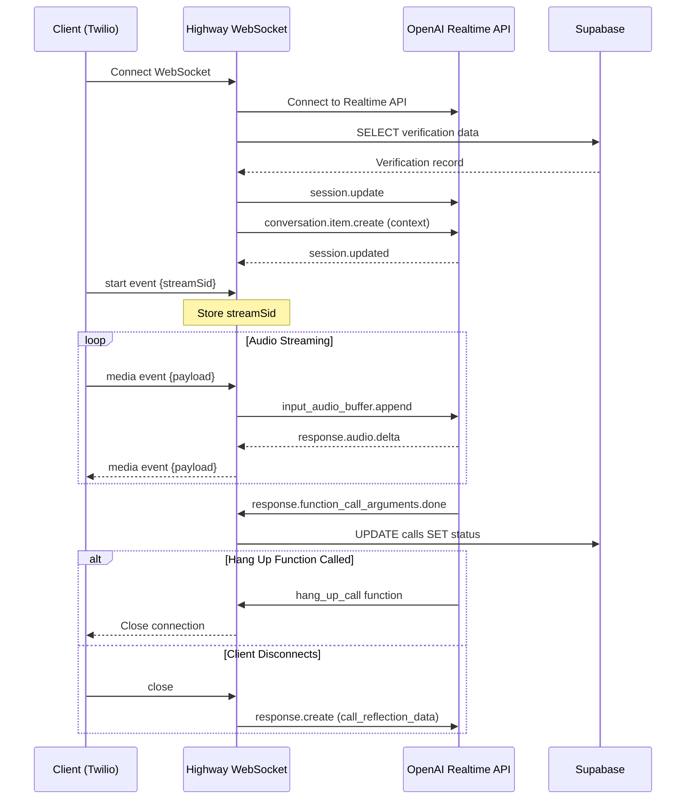

## Endpoint

```
ws://your-domain.com/media-stream/:id/:numid
```

Establishes a WebSocket connection for bidirectional audio streaming between a client (typically Twilio) and the OpenAI Realtime API.

## Path Parameters

<ParamField path="id" type="string" required>
  The verification ID from the database. Used to fetch verification context and customer data that will be used in the AI conversation.
</ParamField>

<ParamField path="numid" type="string" required>
  The call ID from the database. Used to track and update the status of the current verification call.
</ParamField>

## Connection Flow

### 1. Initial Connection

When a client connects to the WebSocket endpoint:

```javascript
const ws = new WebSocket('ws://your-domain.com/media-stream/ver_123/call_456');
```

Highway performs the following sequence:

1. **Establish OpenAI Connection**
   ```javascript
   // Connects to OpenAI Realtime API
   wss://api.openai.com/v1/realtime?model=gpt-4o-realtime-preview-2024-10-01
   ```

2. **Fetch Verification Data**
   ```javascript
   // Retrieves verification record from Supabase
   SELECT * FROM verifications WHERE id = :id
   ```

3. **Configure Session**
   ```javascript
   {
     "type": "session.update",
     "session": {
       // Session configuration from conversationConfig.js
     }
   }
   ```

4. **Initialize Conversation**
   ```javascript
   {
     "type": "conversation.item.create",
     "item": {
       "type": "message",
       "role": "user",
       "content": [{
         "type": "input_text",
         "text": "SYSTEM:(Explain to the customer that you are an agent with Olive Financial...)"
       }]
     }
   }
   ```

### 2. Message Flow Diagram



## Message Types

### Incoming: start Event

Sent by the client to initialize the audio stream.

**Format**:
```json
{
  "event": "start",
  "start": {
    "streamSid": "MZ1234567890abcdef",
    "callSid": "CA1234567890abcdef",
    "customParameters": {}
  }
}
```

**Handler**:
```javascript
case "start":
  streamSid = data.start.streamSid;
  logger.info("Incoming stream has started", streamSid);
  break;
```

The `streamSid` is stored and used to tag all outgoing media events.

### Incoming: media Event

Streams audio data from the client to Highway.

**Format**:
```json
{
  "event": "media",
  "media": {
    "payload": "<base64-encoded-audio>",
    "timestamp": "1234567890"
  }
}
```

**Handler**:
```javascript
case "media":
  if (openAiWs.readyState === WebSocket.OPEN) {
    const audioAppend = {
      type: "input_audio_buffer.append",
      audio: data.media.payload
    };
    openAiWs.send(JSON.stringify(audioAppend));
  }
  break;
```

Audio is forwarded directly to OpenAI's Realtime API for processing.

### Outgoing: media Event

Streams AI-generated audio responses back to the client.

**Format**:
```json
{
  "event": "media",
  "streamSid": "MZ1234567890abcdef",
  "media": {
    "payload": "<base64-encoded-audio>"
  }
}
```

**Source**:
```javascript
if (response.type === "response.audio.delta" && response.delta) {
  const audioDelta = {
    event: "media",
    streamSid: streamSid,
    media: {
      payload: Buffer.from(response.delta, "base64").toString("base64")
    }
  };
  ws.send(JSON.stringify(audioDelta));
}
```

Received from OpenAI as `response.audio.delta` events and forwarded to the client.

## OpenAI WebSocket Integration

### Connection Details

**Endpoint**: `wss://api.openai.com/v1/realtime?model=gpt-4o-realtime-preview-2024-10-01`

**Headers**:
```javascript
{
  "Authorization": "Bearer ${OPENAI_API_KEY}",
  "OpenAI-Beta": "realtime=v1"
}
```

### Key OpenAI Events

#### session.updated

Confirms the session configuration was applied.

```javascript
openAiWs.on("message", (data) => {
  const response = JSON.parse(data);
  if (response.type === "session.updated") {
    logger.info("Session updated successfully:", response);
  }
});
```

#### response.audio.delta

Streams audio response chunks from OpenAI.

```javascript
if (response.type === "response.audio.delta" && response.delta) {
  // Forward to client as media event
}
```

#### response.function_call_arguments.done

Indicates a function call has completed with arguments.

```javascript
if (response.type === "response.function_call_arguments.done") {
  // Update call status in database
  supabase
    .from("calls")
    .update({ status: response.arguments.status })
    .eq("id", callId);
    
  // Check if hang_up_call was triggered
  if (response.name === "hang_up_call") {
    ws.close();
  }
}
```

## Audio Streaming Protocol

### Client → OpenAI

1. Client sends base64-encoded audio via `media` event
2. Highway validates OpenAI connection is open
3. Audio is wrapped in `input_audio_buffer.append` event
4. Sent to OpenAI Realtime API

```javascript
// Incoming from client
{"event": "media", "media": {"payload": "..."}}

// Forwarded to OpenAI
{"type": "input_audio_buffer.append", "audio": "..."}
```

### OpenAI → Client

1. OpenAI generates audio response as `response.audio.delta`
2. Highway extracts the delta payload
3. Wrapped in `media` event with `streamSid`
4. Sent to client WebSocket

```javascript
// From OpenAI
{"type": "response.audio.delta", "delta": "..."}

// To client
{"event": "media", "streamSid": "...", "media": {"payload": "..."}}
```

## Error Handling

### Message Parsing Errors

```javascript
ws.on("message", (message) => {
  try {
    const data = JSON.parse(message);
    // Process message
  } catch (error) {
    logger.error("Error parsing message:", error, "Message:", message);
  }
});
```

Invalid JSON is logged but does not terminate the connection.

### OpenAI Connection Errors

```javascript
openAiWs.on("error", (error) => {
  logger.error("Error in the OpenAI WebSocket:", error);
});
```

Errors are logged for monitoring. The client connection remains active.

### Database Errors

```javascript
const { data, error } = await supabase
  .from("verifications")
  .select("*")
  .eq("id", streamId);
```

If verification data cannot be fetched, the session cannot initialize properly.

## Connection Close Handling

### Client Disconnect

```javascript
ws.on("close", () => {
  // Request final reflection data from OpenAI
  openAiWs.send(JSON.stringify({
    type: "response.create",
    response: {
      modalities: ["text"],
      tool_choice: {
        type: "function",
        name: "call_reflection_data"
      }
    }
  }));
  
  logger.info("Client disconnected.");
});
```

When the client disconnects, Highway triggers the `call_reflection_data` function to collect final insights before closing.

### OpenAI Disconnect

```javascript
openAiWs.on("close", () => {
  logger.info("Disconnected from the OpenAI Realtime API");
});
```

### AI-Initiated Hangup

```javascript
if (response.type === "response.function_call_arguments.done" &&
    response.name === "hang_up_call") {
  ws.close(); // Close client connection
}
```

When OpenAI determines the conversation should end, it calls the `hang_up_call` function, triggering a graceful connection close.

## Example Usage

### Twilio Integration

```xml
<?xml version="1.0" encoding="UTF-8"?>
<Response>
  <Connect>
    <Stream url="wss://your-highway-instance.com/media-stream/ver_abc123/call_xyz789" />
  </Connect>
</Response>
```

### JavaScript Client

```javascript
const ws = new WebSocket('ws://localhost:3000/media-stream/ver_abc123/call_xyz789');

ws.on('open', () => {
  // Send start event
  ws.send(JSON.stringify({
    event: 'start',
    start: {
      streamSid: 'MZ1234567890abcdef'
    }
  }));
});

ws.on('message', (data) => {
  const message = JSON.parse(data);
  
  if (message.event === 'media') {
    // Handle incoming audio from AI
    const audioPayload = message.media.payload;
    // Play or process audio
  }
});

// Send audio to Highway
function sendAudio(base64Audio) {
  ws.send(JSON.stringify({
    event: 'media',
    media: {
      payload: base64Audio
    }
  }));
}
```

## Status Updates

The endpoint automatically updates call status in the database when OpenAI functions are triggered:

```javascript
supabase
  .from("calls")
  .update({ status: response.arguments.status })
  .eq("id", callId);
```

This enables real-time tracking of verification call progress in your application.