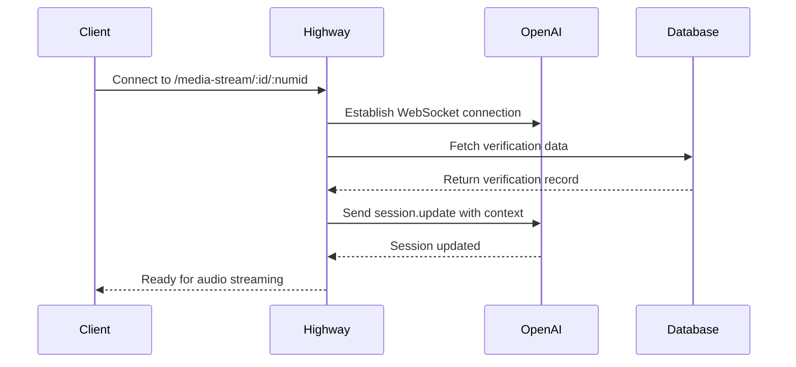

## Purpose

The Highway WebSocket API enables real-time bidirectional audio streaming between clients (such as Twilio voice calls) and the OpenAI Realtime API for voice-based verification conversations.

## Connection Setup

WebSocket connections are established through the `/media-stream/:id/:numid` endpoint, which creates a bridge between:

1. **Client Connection** - Incoming audio stream (typically from Twilio)
2. **OpenAI Realtime API** - AI-powered conversation processing

The connection flow:



## Message Format

All WebSocket messages use JSON format with an `event` field indicating the message type.

### Incoming Messages (Client → Highway)

```json
{
  "event": "media",
  "media": {
    "payload": "<base64-encoded-audio>"
  }
}
```

```json
{
  "event": "start",
  "start": {
    "streamSid": "MZ1234567890abcdef"
  }
}
```

### Outgoing Messages (Highway → Client)

```json
{
  "event": "media",
  "streamSid": "MZ1234567890abcdef",
  "media": {
    "payload": "<base64-encoded-audio>"
  }
}
```

## Event Types

### media

Streams audio data between the client and Highway.

**Direction**: Bidirectional

**Client → Highway**: Raw audio from the caller is forwarded to OpenAI's Realtime API

**Highway → Client**: AI-generated audio responses are sent back to the caller

### start

Initiates the audio stream and provides the stream session identifier.

**Direction**: Client → Highway

**Purpose**: Establishes the `streamSid` which is used to tag all subsequent media events

## Audio Format

The WebSocket connection supports **μ-law (G.711 ULAW)** encoded audio:

- **Encoding**: G.711 μ-law
- **Sample Rate**: 8 kHz
- **Format**: Base64-encoded payload
- **Channels**: Mono

This format is compatible with Twilio's Media Streams and is automatically transcoded by OpenAI's Realtime API.

## Connection Lifecycle

### 1. Connection Established

- Client connects to the WebSocket endpoint
- Highway establishes connection to OpenAI Realtime API
- Verification data is fetched from the database
- Session configuration is sent to OpenAI

### 2. Active Streaming

- Client sends `start` event with stream session ID
- Bidirectional audio streaming begins
- `media` events flow in both directions
- OpenAI processes conversation and triggers functions as needed

### 3. Connection Termination

The connection can close in several ways:

**Client Disconnect**:
```javascript
// Triggers final reflection data collection
response.create with call_reflection_data function
```

**AI-Initiated Hangup**:
```javascript
// OpenAI calls hang_up_call function
ws.close()
```

**Error Conditions**:
- OpenAI WebSocket disconnection
- Network failures
- Invalid message formats

## Error Handling

The WebSocket implementation includes comprehensive error handling:

- **Message Parsing Errors**: Invalid JSON messages are logged and ignored
- **OpenAI Errors**: Connection issues are logged and the client connection is maintained
- **Database Errors**: If verification data cannot be fetched, the session cannot initialize

All errors are logged with context for debugging and monitoring.

## Integration Pattern

The WebSocket serves as a real-time proxy:

```
[Twilio Call] ←→ [Highway WebSocket] ←→ [OpenAI Realtime API]
                         ↕
                  [Supabase Database]
```

- **Twilio** handles telephony and sends/receives audio
- **Highway** orchestrates the conversation flow and manages state
- **OpenAI** processes natural language and generates responses
- **Supabase** stores verification data and call status