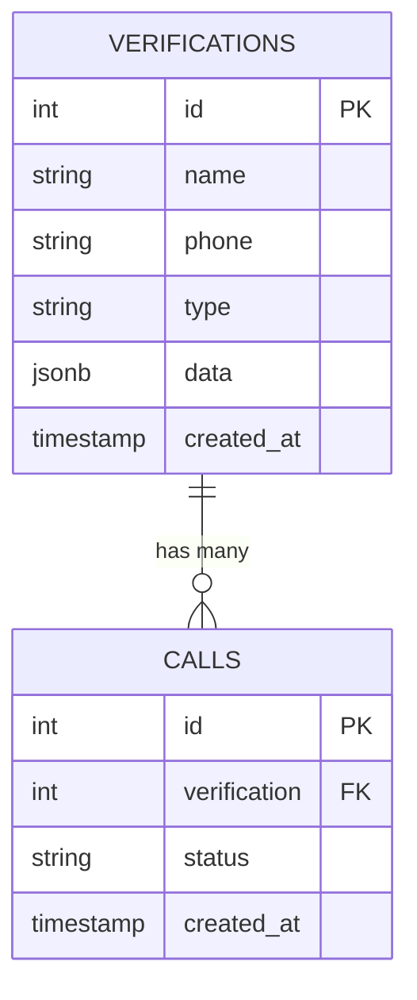

## Overview

Highway uses Supabase as its backend database and real-time data platform. All verification records, call logs, and customer data are stored in Supabase PostgreSQL tables with automatic persistence and querying capabilities.

## Database Architecture

Highway's data model consists of two primary tables with a one-to-many relationship:



## Database Schema

### Verifications Table

The `verifications` table stores customer information and the data points that need to be verified.

<Tabs>
  <Tab title="Schema">
    | Column | Type | Constraints | Description |
    |--------|------|-------------|-------------|
    | `id` | `integer` | PRIMARY KEY, AUTO INCREMENT | Unique verification identifier |
    | `name` | `text` | NOT NULL | Customer's full name |
    | `phone` | `text` | NOT NULL | 10-digit phone number |
    | `type` | `text` | NOT NULL | Background/context for verification |
    | `data` | `jsonb` | NOT NULL | Verification questions as JSON |
    | `created_at` | `timestamp with time zone` | DEFAULT now() | When verification was created |
  </Tab>
  
  <Tab title="Example Data">
    ```json
    {
      "id": 42,
      "name": "John Smith",
      "phone": "5551234567",
      "type": "Customer applied for business loan",
      "data": {
        "date_of_birth": "1985-03-15",
        "ssn_last_4": "1234",
        "address": "123 Main St, Springfield, IL 62701",
        "employer": "Acme Corporation"
      },
      "created_at": "2024-10-15T14:30:00Z"
    }
    ```
  </Tab>
  
  <Tab title="Queries">
    ```sql
    -- Create new verification
    INSERT INTO verifications (name, phone, type, data)
    VALUES (
      'Jane Doe',
      '5559876543',
      'Account activation',
      '{"dob": "1990-01-01", "address": "456 Oak Ave"}'
    );
    
    -- Get all verifications (newest first)
    SELECT * FROM verifications
    ORDER BY created_at DESC;
    
    -- Get specific verification
    SELECT * FROM verifications
    WHERE id = 42;
    
    -- Search by name
    SELECT * FROM verifications
    WHERE name ILIKE '%smith%';
    ```
  </Tab>
</Tabs>

### JSONB Data Field

The `data` column uses PostgreSQL's `jsonb` type for flexible, queryable JSON storage:

<AccordionGroup>
  <Accordion title="Advantages of JSONB" icon="check">
    - **Flexible Schema:** Each verification can have different data fields
    - **Queryable:** Can search within JSON using PostgreSQL operators
    - **Indexed:** Supports GIN indexes for fast JSON queries
    - **Typed:** Validates JSON structure on insert
  </Accordion>
  
  <Accordion title="Example JSON Queries" icon="magnifying-glass">
    ```sql
    -- Find verifications with specific DOB
    SELECT * FROM verifications
    WHERE data->>'date_of_birth' = '1990-01-01';
    
    -- Find verifications containing address field
    SELECT * FROM verifications
    WHERE data ? 'address';
    
    -- Find verifications with SSN field
    SELECT id, name, data->'ssn_last_4' as ssn
    FROM verifications
    WHERE data ? 'ssn_last_4';
    ```
  </Accordion>
  
  <Accordion title="Best Practices" icon="lightbulb">
    - Use consistent field naming (snake_case recommended)
    - Keep JSON structure flat when possible
    - Don't store overly nested objects
    - Use descriptive key names
    - Validate JSON on the frontend before insert
  </Accordion>
</AccordionGroup>

### Calls Table

The `calls` table tracks individual phone verification attempts and their outcomes.

<Tabs>
  <Tab title="Schema">
    | Column | Type | Constraints | Description |
    |--------|------|-------------|-------------|
    | `id` | `integer` | PRIMARY KEY, AUTO INCREMENT | Unique call identifier |
    | `verification` | `integer` | FOREIGN KEY → verifications(id) | Associated verification record |
    | `status` | `text` | NOT NULL | Current call status |
    | `created_at` | `timestamp with time zone` | DEFAULT now() | When call was initiated |
  </Tab>
  
  <Tab title="Example Data">
    ```json
    {
      "id": 123,
      "verification": 42,
      "status": "successful_call",
      "created_at": "2024-10-15T15:45:00Z"
    }
    ```
  </Tab>
  
  <Tab title="Queries">
    ```sql
    -- Create new call
    INSERT INTO calls (verification, status)
    VALUES (42, 'in_progress');
    
    -- Get all calls with verification details
    SELECT c.*, v.name, v.phone, v.data
    FROM calls c
    JOIN verifications v ON c.verification = v.id
    ORDER BY c.created_at DESC;
    
    -- Get calls for specific verification
    SELECT * FROM calls
    WHERE verification = 42
    ORDER BY created_at DESC;
    
    -- Update call status
    UPDATE calls
    SET status = 'successful_call'
    WHERE id = 123;
    ```
  </Tab>
</Tabs>

### Status Values

The `status` field uses predefined string values:

```typescript
type CallStatus = 
  | "in_progress"
  | "successful_call"
  | "unsuccessful_call"
  | "user_hung_up"
  | "system_error";
```

<Note>
  These status values match the enum in the `call_reflection_data` function (`highway-backend/conversationConfig.js:36-44`).
</Note>

## Data Persistence

Highway persists data at several key points in the verification workflow:

### 1. Creating Verifications

From `highway-frontend/src/app/page.tsx:111-129`:

```typescript
const handleSubmit = async (values: typeof form.values) => {
  const supabase = createClient();
  const { data, error } = await supabase.from("verifications").insert({
    name: values.name,
    phone: values.phoneNumber,
    data: JSON.parse(values.userData),
    type: values.type,
  });
  
  if (error) {
    console.error("Error adding verification:", error);
  } else {
    fetchCustomers(); // Refresh list
    closeAddUserModal();
    form.reset();
  }
};
```

**When:** User clicks "Add verification" button

**What's stored:** Customer name, phone, background, and verification data

### 2. Initiating Calls

From `highway-backend/routes.js:35-44`:

```javascript
router.post("/call-customer", async (req, res) => {
  const { to, verification } = req.body;
  
  const { data } = await supabase
    .from("calls")
    .insert([{ verification: verification, status: "in_progress" }])
    .select();
    
  // Call ID is used in Twilio stream URL
  const call = await client.calls.create({
    to: to,
    from: TWILIO_PHONE_NUMBER,
    twiml: `<Stream url="wss://${req.headers.host}/media-stream/${verification}/${data[0].id}" />`
  });
});
```

**When:** User clicks "Initiate call" button

**What's stored:** New call record with `in_progress` status and verification foreign key

### 3. Loading Verification Data

From `highway-backend/websocket.js:63-76`:

```javascript
openAiWs.on("open", async () => {
  const { data, error } = await supabase
    .from("verifications")
    .select("*")
    .eq("id", streamId);
    
  if (data) {
    bigdata = JSON.stringify(data[0]);
    sendSessionUpdate();
  }
});
```

**When:** WebSocket connection to OpenAI is established

**What's retrieved:** Complete verification record for AI context

### 4. Updating Call Status

From `highway-backend/websocket.js:86-92`:

```javascript
if (response.type === "response.function_call_arguments.done") {
  supabase
    .from("calls")
    .update({ status: response.arguments.status })
    .eq("id", callId);
}
```

**When:** AI calls `call_reflection_data` function

**What's updated:** Call status changed to final outcome

## Supabase Client Setup

### Frontend Client

From `highway-frontend/src/utils/supabase/client.ts:1-9`:

```typescript
import { createBrowserClient } from "@supabase/ssr";

export const createClient = () =>
  createBrowserClient(
    process.env.NEXT_PUBLIC_SUPABASE_URL!,
    process.env.NEXT_PUBLIC_SUPABASE_ANON_KEY!
  );
```

**Usage:**
```typescript
const supabase = createClient();
const { data } = await supabase.from("verifications").select("*");
```

### Backend Client

From `highway-backend/websocket.js:5-9`:

```javascript
const { createClient } = require("@supabase/supabase-js");
const supabase = createClient(
  "https://umbkzjfffeoykaxsghly.supabase.co",
  "eyJhbGciOiJIUzI1NiIsInR5cCI6IkpXVCJ9..."
);
```

<Warning>
  The backend uses hardcoded credentials in the source code. For production deployments, move these to environment variables:
  
  ```javascript
  const supabase = createClient(
    process.env.SUPABASE_URL,
    process.env.SUPABASE_ANON_KEY
  );
  ```
</Warning>

## Common Query Patterns

### Fetching Verifications

From `highway-frontend/src/app/page.tsx:57-69`:

```typescript
const fetchCustomers = async () => {
  const supabase = createClient();
  const { data, error } = await supabase
    .from("verifications")
    .select("*")
    .order("created_at", { ascending: false });
    
  if (error) {
    console.error("Error fetching customers:", error);
  } else {
    setCustomers(data || []);
  }
};
```

### Fetching Calls with Verifications

From `highway-frontend/src/app/calls/page.tsx:40-80`:

```typescript
const fetchData = async () => {
  const supabase = createClient();
  
  // 1. Fetch all calls
  const { data: callsData } = await supabase
    .from("calls")
    .select("*")
    .order("created_at", { ascending: false });
    
  // 2. Get unique verification IDs from calls
  const verificationIds = [
    ...new Set(callsData?.map((call) => call.verification)),
  ];
  
  // 3. Fetch all related verifications
  const { data: verificationsData } = await supabase
    .from("verifications")
    .select("*")
    .in("id", verificationIds);
    
  // 4. Create lookup map
  const verificationsMap = verificationsData?.reduce(
    (acc, verification) => {
      acc[verification.id] = verification;
      return acc;
    },
    {}
  );
};
```

<Note>
  This pattern avoids N+1 queries by fetching all verifications in a single query using `.in()`.
</Note>

### Inserting with Return Data

```typescript
const { data, error } = await supabase
  .from("verifications")
  .insert({ name: "John Doe", phone: "5551234567", ... })
  .select();
  
// data[0] contains the inserted record with auto-generated id
```

### Updating Records

```typescript
const { error } = await supabase
  .from("calls")
  .update({ status: "successful_call" })
  .eq("id", callId);
```

## Authentication and Security

### Row Level Security (RLS)

<Warning>
  The current implementation uses the **anon key** which provides public access. For production:
  
  1. Enable Row Level Security on both tables
  2. Create policies to restrict access
  3. Implement authentication
  4. Use authenticated user context in queries
</Warning>

### Recommended RLS Policies

<CodeGroup>
```sql Verifications Policies
-- Enable RLS
ALTER TABLE verifications ENABLE ROW LEVEL SECURITY;

-- Allow authenticated users to read their own verifications
CREATE POLICY "Users can view own verifications"
ON verifications FOR SELECT
USING (auth.uid() = user_id);

-- Allow authenticated users to create verifications
CREATE POLICY "Users can create verifications"
ON verifications FOR INSERT
WITH CHECK (auth.uid() = user_id);
```

```sql Calls Policies
-- Enable RLS
ALTER TABLE calls ENABLE ROW LEVEL SECURITY;

-- Allow authenticated users to view calls for their verifications
CREATE POLICY "Users can view own calls"
ON calls FOR SELECT
USING (
  verification IN (
    SELECT id FROM verifications WHERE user_id = auth.uid()
  )
);

-- Allow system to create and update calls
CREATE POLICY "Service role can manage calls"
ON calls FOR ALL
USING (auth.role() = 'service_role');
```
</CodeGroup>

### API Key Security

**Current approach:**
- Frontend uses public `NEXT_PUBLIC_SUPABASE_ANON_KEY`
- Backend uses same anon key hardcoded

**Production recommendations:**

1. **Frontend:** Keep using anon key with RLS policies
2. **Backend:** Use service role key for privileged operations
3. **Environment variables:** Never commit keys to version control

```bash .env.local
# Frontend
NEXT_PUBLIC_SUPABASE_URL=https://your-project.supabase.co
NEXT_PUBLIC_SUPABASE_ANON_KEY=eyJhbGci...

# Backend
SUPABASE_URL=https://your-project.supabase.co
SUPABASE_SERVICE_ROLE_KEY=eyJhbGci...  # More privileges
```

## Real-Time Subscriptions

Supabase supports real-time subscriptions for live updates. While not currently implemented in Highway, you could add:

```typescript
// Subscribe to new calls
const subscription = supabase
  .channel('calls')
  .on(
    'postgres_changes',
    { 
      event: 'INSERT', 
      schema: 'public', 
      table: 'calls' 
    },
    (payload) => {
      console.log('New call:', payload.new);
      // Update UI with new call
    }
  )
  .subscribe();

// Subscribe to call status updates
const statusSub = supabase
  .channel('call-status')
  .on(
    'postgres_changes',
    { 
      event: 'UPDATE', 
      schema: 'public', 
      table: 'calls' 
    },
    (payload) => {
      console.log('Call status updated:', payload.new.status);
      // Update call badge in real-time
    }
  )
  .subscribe();
```

<Accordion title="Use Cases for Real-Time" icon="bolt">
  - **Live call status updates:** See status change from "in_progress" to "successful_call" without refreshing
  - **New verification notifications:** Alert when team members add verifications
  - **Dashboard sync:** Keep multiple browser tabs in sync
  - **Monitoring dashboards:** Real-time call volume tracking
</Accordion>

## Data Backup and Migration

### Exporting Data

```sql
-- Export verifications to CSV
COPY verifications TO '/tmp/verifications.csv' CSV HEADER;

-- Export calls to CSV
COPY calls TO '/tmp/calls.csv' CSV HEADER;

-- Export with JOIN
COPY (
  SELECT c.*, v.name, v.phone 
  FROM calls c 
  JOIN verifications v ON c.verification = v.id
) TO '/tmp/call_report.csv' CSV HEADER;
```

### Database Migrations

For schema changes, use Supabase migrations:

```sql
-- migrations/20241015_add_notes_column.sql
ALTER TABLE verifications
ADD COLUMN notes TEXT;

-- migrations/20241015_add_duration_column.sql
ALTER TABLE calls
ADD COLUMN duration_seconds INTEGER;
```

## Best Practices

<AccordionGroup>
  <Accordion title="Query Optimization" icon="gauge-high">
    - Use `.select()` to specify only needed columns
    - Add indexes on frequently queried fields
    - Use `.limit()` for pagination
    - Avoid N+1 queries with `.in()` operator
    - Use `.explain()` to analyze query performance
  </Accordion>
  
  <Accordion title="Data Integrity" icon="shield-check">
    - Always validate JSON before inserting into `data` field
    - Use database constraints (NOT NULL, FOREIGN KEY)
    - Handle errors gracefully in application code
    - Consider adding CHECK constraints for status values
    - Use transactions for multi-step operations
  </Accordion>
  
  <Accordion title="Error Handling" icon="triangle-exclamation">
    ```typescript
    const { data, error } = await supabase
      .from("verifications")
      .insert(newVerification);
      
    if (error) {
      console.error("Database error:", error);
      // Show user-friendly error message
      // Log to error tracking service
      // Don't expose database details to users
    }
    ```
  </Accordion>
  
  <Accordion title="Performance" icon="rocket">
    - Create indexes on foreign keys
    - Use connection pooling
    - Cache frequently accessed data
    - Paginate large result sets
    - Monitor query performance in Supabase dashboard
  </Accordion>
</AccordionGroup>

## Next Steps

<CardGroup cols={2}>
  <Card title="Verification Management" icon="clipboard-check" href="/features/verification-management">
    Learn how to create and manage verification records
  </Card>
  
  <Card title="Call Monitoring" icon="chart-line" href="/features/call-monitoring">
    Query and analyze call data
  </Card>
  
  <Card title="Configuration" icon="gear" href="/setup/environment-variables">
    Set up Supabase environment variables
  </Card>
  
  <Card title="API Reference" icon="book" href="/api/overview">
    Explore the complete API
  </Card>
</CardGroup>